# System Architecture

## High-Level Architecture

```mermaid
graph TB
    subgraph User Interface
        A["🖥️ Streamlit UI<br/>(streamlit_app.py)"]
    end

    subgraph FastAPI Backend
        B["🌐 FastAPI Server<br/>(api.py)"]
        C["🛡️ Prompt Guardrail<br/>(guardrail.py)"]
        D["🧪 Evaluation Module<br/>(evaluation.py)"]
    end

    subgraph RAG Engine
        E["📄 PDF Loader<br/>(PyPDFLoader)"]
        F["✂️ Text Chunking<br/>(3 Strategies)"]
        G["🔢 Embeddings<br/>(all-MiniLM-L6-v2)"]
        H["📦 FAISS Vector Store"]
        I["🤖 LLM<br/>(flan-t5-base)"]
        J["🔗 RetrievalQA Chain"]
    end

    A -->|"HTTP Requests"| B
    B --> C
    C -->|"Validated Query"| J
    B -->|"Upload PDF"| E
    B --> D
    E --> F
    F --> G
    G --> H
    H -->|"Top-K Chunks"| J
    I --> J
    D -->|"Retrieve Chunks"| H
    J -->|"Answer + Sources"| B
    B -->|"JSON Response"| A

    style A fill:#4CAF50,color:#fff
    style B fill:#2196F3,color:#fff
    style C fill:#FF9800,color:#fff
    style D fill:#9C27B0,color:#fff
    style H fill:#f44336,color:#fff
    style I fill:#E91E63,color:#fff
    style J fill:#00BCD4,color:#fff
```

## RAG Pipeline Flow

## Chunking Strategies Comparison

```mermaid
graph LR
    subgraph Input
        PDF["📄 PDF Document"]
    end

    subgraph Strategy 1: Fixed
        F1["Chunk 1<br/>500 chars"]
        F2["Chunk 2<br/>500 chars"]
        F3["Chunk 3<br/>500 chars"]
        F4["..."]
    end

    subgraph Strategy 2: Medium
        M1["Chunk 1<br/>1000 chars"]
        M2["Chunk 2<br/>1000 chars"]
        M3["..."]
    end

    subgraph Strategy 3: Sentence
        S1["Sentence Group 1"]
        S2["Sentence Group 2"]
        S3["Sentence Group 3"]
        S4["..."]
    end

    PDF --> F1
    PDF --> M1
    PDF --> S1

    style F1 fill:#4CAF50,color:#fff
    style F2 fill:#4CAF50,color:#fff
    style F3 fill:#4CAF50,color:#fff
    style M1 fill:#2196F3,color:#fff
    style M2 fill:#2196F3,color:#fff
    style S1 fill:#FF9800,color:#fff
    style S2 fill:#FF9800,color:#fff
    style S3 fill:#FF9800,color:#fff
```

## Component Details

| Component | File | Responsibility |
|-----------|------|---------------|
| Config | `app/config.py` | Environment variables, settings |
| RAG Engine | `app/rag_engine.py` | PDF loading, chunking, embedding, QA |
| Guardrail | `app/guardrail.py` | Input validation, injection protection |
| Evaluation | `app/evaluation.py` | Hit Rate & MRR metric calculation |
| API | `app/api.py` | REST endpoints, request handling |
| UI | `ui/streamlit_app.py` | Chat interface, file upload |
